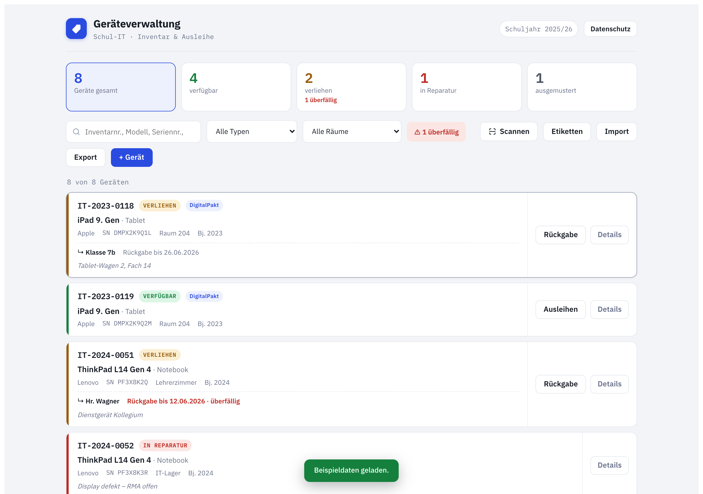
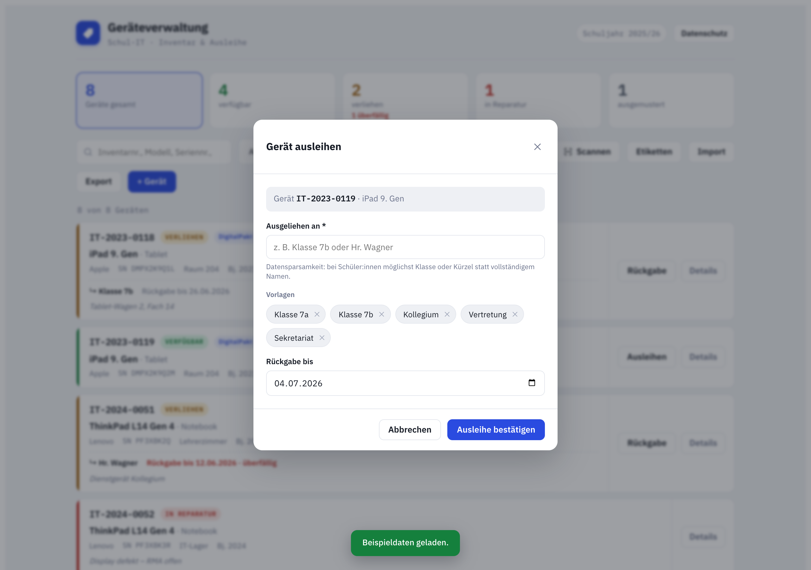
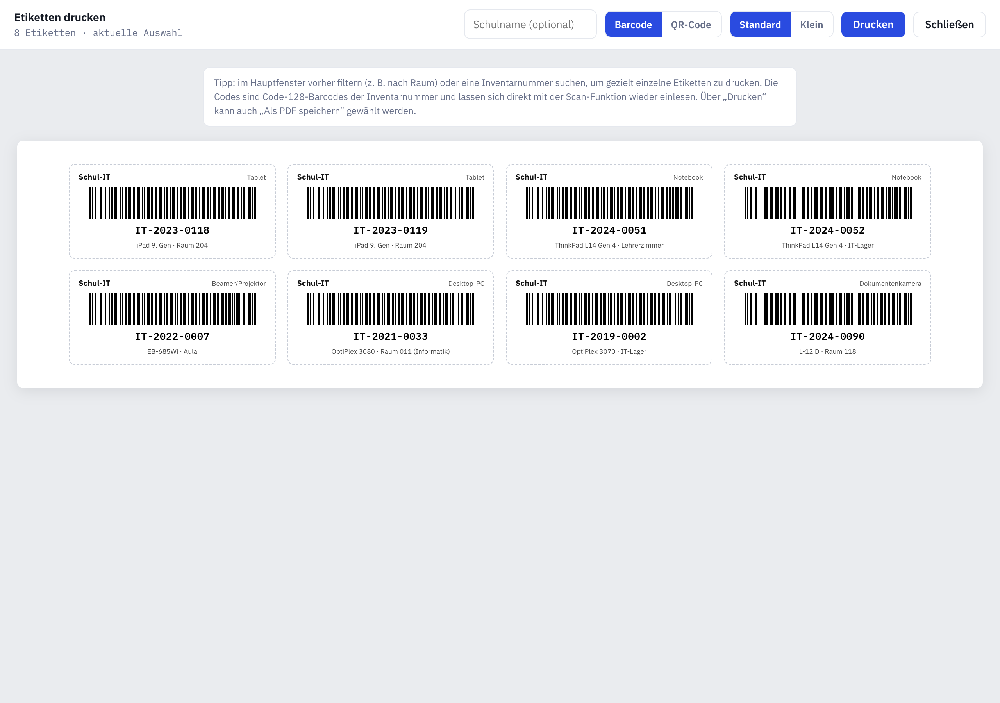

# Geräteverwaltung – Schul-IT Inventar & Ausleihe

Eine schlanke, **lokal laufende** Web-Anwendung zur Verwaltung von IT-Geräten an Schulen:
Inventarisierung, Ausleihe/Rückgabe, Druck von Barcode-/QR-Etiketten sowie CSV-Im- und Export.
Alle Daten bleiben ausschließlich im Browser (`localStorage`) – **keine Übertragung an Dritte**.

**🔗 Live-Demo: https://haydarkozat.github.io/geraeteverwaltung/**

Über „Beispieldaten laden“ lässt sich das Werkzeug direkt im Browser ausprobieren.

## Screenshots

### Übersicht – Inventar, Status & Ausleihe


### Ausleihe mit Vorlagen & Rückgabedatum


### Etikettendruck mit Barcodes


## Funktionen

- **Inventar** mit Status (verfügbar, verliehen, in Reparatur, ausgemustert), Typ, Standort, Seriennummer, DigitalPakt-Kennzeichnung u. v. m.
- **Ausleihe & Rückgabe** mit Rückgabedatum und Überfälligkeits-Warnung
- **Suche & Filter** nach Status, Typ, Raum und Freitext
- **Etikettendruck**: Code-128-Barcodes oder QR-Codes (ohne externe Bibliothek erzeugt), in zwei Größen
- **Scannen** per Handscanner (Tastatur-Modus), manueller Eingabe oder Gerätekamera (`BarcodeDetector`)
- **CSV-Import/-Export** (Upsert anhand der Inventarnummer, deutsche Spaltenüberschriften)
- **DSGVO-Hinweise** und Datensparsamkeit eingebaut
- Komplett **offline** nutzbar, keine Backend-Abhängigkeit

## Schnellstart

Voraussetzung: [Node.js](https://nodejs.org/) 18+.

```bash
npm install
npm run dev
```

Dann die angezeigte URL (standardmäßig http://localhost:5173) im Browser öffnen.
Über „Beispieldaten laden“ lässt sich das Werkzeug sofort ausprobieren.

### Produktions-Build

```bash
npm run build      # erzeugt dist/
npm run preview    # lokale Vorschau des Builds
```

## Aufbau

| Datei | Inhalt |
| --- | --- |
| `src/App.jsx` | Komplette Anwendung (UI, Barcode-/QR-Generator, CSV-Logik, State) |
| `src/main.jsx` | Einstiegspunkt; bindet React ein und stellt eine `localStorage`-Persistenz bereit |
| `index.html` | HTML-Grundgerüst |

## Datenschutz

Inventar- und Ausleihdaten werden ausschließlich lokal im Browserprofil gespeichert.
Für den verbindlichen Einsatz im Schulbetrieb das schulische Datenschutzkonzept beachten
und im Zweifel mit der/dem Datenschutzbeauftragten abstimmen. Dieses Werkzeug ersetzt
keine rechtliche Beratung.
